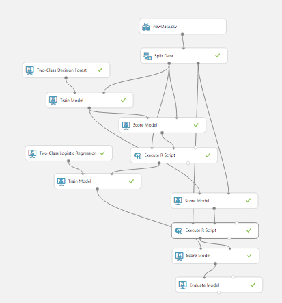
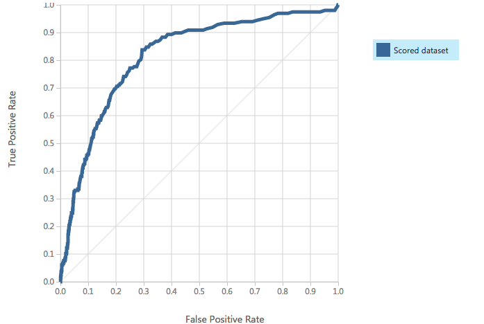
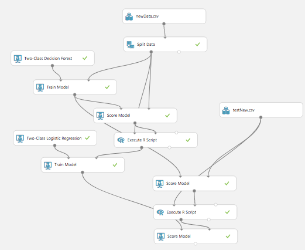

```{r setup, include=FALSE}
knitr::opts_chunk$set(echo = TRUE)
library(EBImage)
```

## Introduction

This project has been made for Pierre Fabre AI Challenge in France (december 2017), and the goad was to predict the risk of a malign melanoma from a picture. I used R and Azure ML Studio, and finished 7th (310 teams were doing this event).

## Image reading
First I created a program to read the images and output a table with all the vectors with EBImage package. 

```{r eval=FALSE}
library(EBImage)
#list name files and read files
files <- list.files("data/training")
learn <- read.csv2("data/label_learn.csv")

df <- data.frame()
for (i in 1:length(files)) {
        path <- paste("data/training/", files[i], sep="")
        img <- readImage(path)
        #create B&W image
        img <- channel(img, "gray")
        #resize to have vectors of 4096 pixels for each image
        img <- resize(img, w=64, h=64)
        img <- as.vector(img)
        img <- c(learn$label[i], img)
        df <- rbind(df, img)
}
names(df) <- c("label", 1:4096)
df$label <- factor(df$label, levels=c(0,1), labels=c("benign", "malign"))
#output the csv
write.csv(df, file="data1.csv", row.names=FALSE)
```

## Machine Learning

For this step we used Azure ML Studio, as they had a partnership with the challenge and I wanted to try this service. I used only machine learning algorithms.
A convolutional neural network could have been also used maybe more effectively, but at this time I had no clue about how to tune them! If you are interested about doing it feel free to contact me and share your results.

The training phase can be represented by this image :


I first computed a Random Forest and then a Logistic Regression on the output of the first model. I recommend to use a very high treshold and then a manual detection of the false positives, as I don't want to miss a malign melanoma (false negative).

The ROC curve looks like this :



The prediction model is represented by the next image. 



Thank you for reading, feel free to comment and contribute it will be highly appreciated!